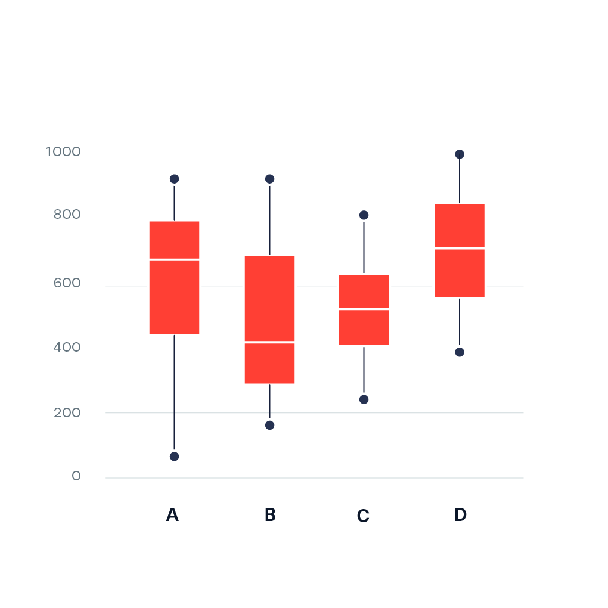
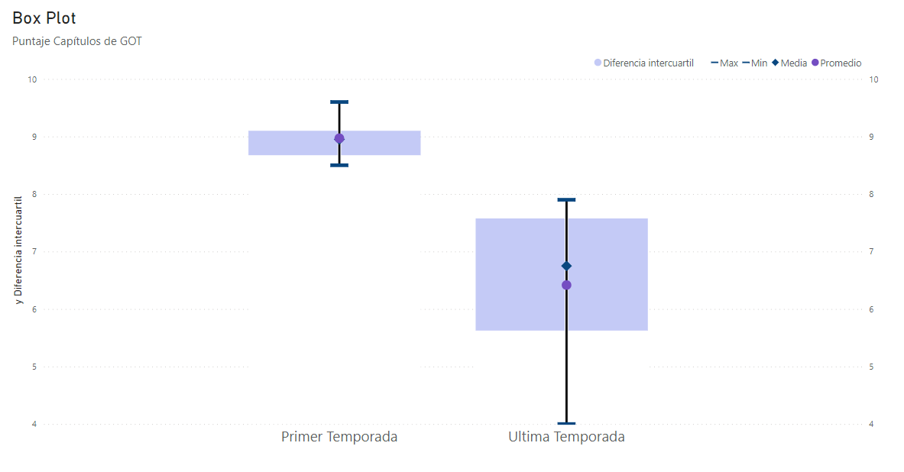

# Crear un **box plot** en Power BI

Un box-plot, también conocido como diagrama de cajas, es una representación gráfica que muestra la distribución de un conjunto de datos a través de cuartiles estadísticos. Consiste en una caja rectangular que abarca el rango intercuartílico, es decir, el rango que va desde el primer cuartil (Q1) hasta el tercer cuartil (Q3). Dentro de la caja, una línea vertical indica la mediana (Q2) del conjunto de datos.

Los extremos de la caja se extienden hasta los valores más extremos dentro de un rango específico, llamados "bigotes". Puntos fuera de este rango se representan individualmente como posibles valores atípicos. Este tipo de gráfico es útil para visualizar la dispersión y la presencia de valores atípicos en un conjunto de datos, proporcionando una visión más completa de la distribución que un simple resumen estadístico.

 

El problema que nos encontramos en Power BI es que no hay una opción nativa de este tipo de gráficos. Podemos explorar e instalar una de las opciones alternativas de la tienda, pero hay una manera de crearlo con las opciones previamente proporcionadas por la aplicación.

En un box plot solo podemos visualizar variables de tipo cuantitativas. Para este ejemplo vamos a utilizar un pequeño dataset con los puntajes de los episodios de la primera y última temporada de Game of Thrones en la página IMDb.
En primer lugar, debemos crear todas las funciones DAX (Data Analysis Expressions) necesarias: media (promedio o Q2), Q1, Q3, valor máximo y valor mínimo.

    Promedio = AVERAGE(data_got[puntaje])
    Media = PERCENTILE.INC(data_got[puntaje], 0.50)
    Cuartil 1 = PERCENTILE.INC(data_got[puntaje], 0.25) 
    Cuartil 3 = PERCENTILE.INC(data_got[puntaje], 0.75)
    Maximo = MAX(data_got[puntaje]) 
    Minimo = MIN(data_got[puntaje])
    Diferencia entre Cuartil 3 y Cuartil 1 = [Cuartil 3] - [Cuartil 1]

Luego, seleccionamos el gráfico de columnas apiladas y de líneas. Los datos se ordenan de la siguiente forma:  

- **Eje X:** "Temporada"
- **Eje Y de línea:** "Media", "Promedio", "Máximo", "Mínimo".
- **Barras de error:** aplicar configuración a Máximo, Límite Superior  = "Máximo", Límite inferior = "Mínimo", activar barra.
- **Eje Y:** "Cuartil 1" y "Diferencia entre Cuartil 3 y Cuartil 1".

En opciones del gráfico debemos:

- **Activar los marcadores**
- **Estilo de línea - ancho del trazo = 0**
- **Eje X y Eje Y de línea: desactivar título**
- **Marcadores: cambiar tamaño, forma y color. Ocultar marcadores de "Cuartil 1" y "Cuartil 3"**
- **Eje Y: ocultar barra de "Cuartil 1"**

En el resultado final podemos comparar fácilmente las medidas de ambas temporadas, como las diferencias significativas entre la distribución y variabilidad de la calificación de los episodios. 